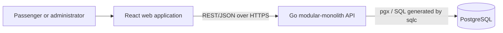

# Segment-Based Train Seat Booking System

Documentation-first design for reserved-seat sales on Sri Lanka's Colombo Fort–Badulla line. A physical seat can be sold again after its passenger leaves, while PostgreSQL remains the final authority preventing overlapping sales.

## Problem and solution

Whole-journey allocation wastes capacity. This system assigns every route station an ordered position and occupies the half-open segment `[origin, destination)`. Thus Colombo Fort → Kandy `[0,4)` and Kandy → Badulla `[4,7)` may share a seat; Peradeniya Junction → Ella `[3,6)` conflicts with `[0,4)`. A PostgreSQL GiST exclusion constraint atomically enforces this rule per train run and seat.

## Main features

- Configurable routes, ordered stations, distances, trains, runs, coaches, layouts, seats, and fares
- Segment-aware availability, fare quotes, booking lookup, cancellation, references, and audit events
- Idempotent booking creation and database-safe concurrency
- Responsive, accessible booking flow and an OpenAPI 3.1 contract
- UTC persistence with `Asia/Colombo` schedule presentation

The initial scope uses direct confirmation without payment. `HELD` and `CONFIRMED` block inventory; `CANCELLED`, `EXPIRED`, and `COMPLETED` do not.

## Technology

Go, Chi, pgx, sqlc, Goose, PostgreSQL, OpenAPI 3.1 and `slog`; React, TypeScript, Vite, TanStack Query, React Hook Form, Zod, Tailwind CSS and shadcn/ui; Docker Compose, GitHub Actions and Make; Go tests/Testify/testcontainers-go plus Vitest, React Testing Library and Playwright.

## Architecture



The API validates and orchestrates; PostgreSQL owns durable integrity. Optional reverse proxy, Redis, queue, notifications, object storage and monitoring are future production components—not initial dependencies. See [system architecture](docs/system-architecture.md), [database design](docs/database-design.md), and [ADRs](docs/adr/).

## Expected local setup

Implementation has not begun; the commands below define the acceptance target for Phase 1.

```bash
git clone <repository-url>
cd segment-train-booking
cp .env.example .env
docker compose up --build
```

Expected services:

| Service | URL |
|---|---|
| Frontend | http://localhost:3000 |
| API | http://localhost:8080 |
| OpenAPI/Swagger | http://localhost:8080/docs |
| PostgreSQL | localhost:5432 |

Planned commands: `make migrate-up`, `make seed`, `make test`, `make test-e2e`, and `make migrate-down`. Docker Compose must apply migrations before API readiness and load demo seed data only when explicitly enabled. Full instructions are in [local development](docs/local-development.md).

Environment values will be documented in `.env.example` using placeholders only: database URL, ports, log level, allowed origins, service timezone, hold duration, and booking horizon. Secrets must never be committed.

## API and behavior

The normative contract is [docs/openapi.yaml](docs/openapi.yaml); endpoint semantics and errors are in [API design](docs/api-design.md). The implementation will serve Swagger UI at `/docs`.

Fare is `base_fee + travelled_distance × class_rate`, subject to configured minimums and multipliers. Money is integer LKR minor units and each booking stores an immutable fare snapshot; see [fare design](docs/fare-design.md).

Availability is advisory. Booking insertion occurs in a transaction; if concurrent requests overlap, the exclusion constraint lets one commit and maps the loser to `409 SEAT_NO_LONGER_AVAILABLE`. Idempotency keys make safe retries return the original result.

## Planned monorepo

```text
apps/api/                 Go API
apps/web/                 React application
packages/                 generated client, shared types, shared config
database/                 Goose migrations, sqlc queries, demo seed
docs/                     product and engineering documentation
scripts/                  developer/CI helpers
.github/workflows/        validation and optional release workflows
```

See [project structure](docs/project-structure.md) and the phased [implementation plan](docs/implementation-plan.md).

## Security, operations, and quality

Secure defaults include parameterized SQL, strict validation, least-privilege DB roles, TLS in production, limited CORS, rate limits, redacted structured logs, protected booking references and append-only audits. See [security](docs/security.md), [observability](docs/observability.md), [testing](docs/testing-strategy.md), [CI/CD](docs/ci-cd.md), and [deployment](docs/deployment.md).

## Limitations and future work

Initial scope excludes payment capture, authentication implementation, waitlists, notifications, real-time push, multi-seat/group atomic booking, live railway feeds, refunds and production cloud deployment. Candidate extras are expiring holds, payment/notification adapters, admin UI, revenue and occupancy analytics, waitlists, WebSocket/SSE refresh, multilingual UX and verified official schedules/fares.

## License

MIT; see [LICENSE](LICENSE). Production ownership and third-party-data terms must be confirmed before launch.
