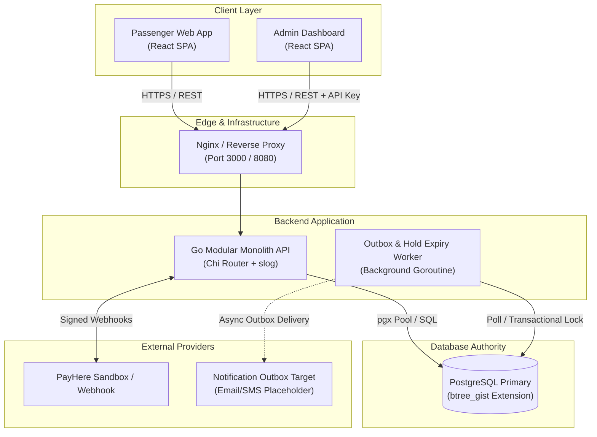
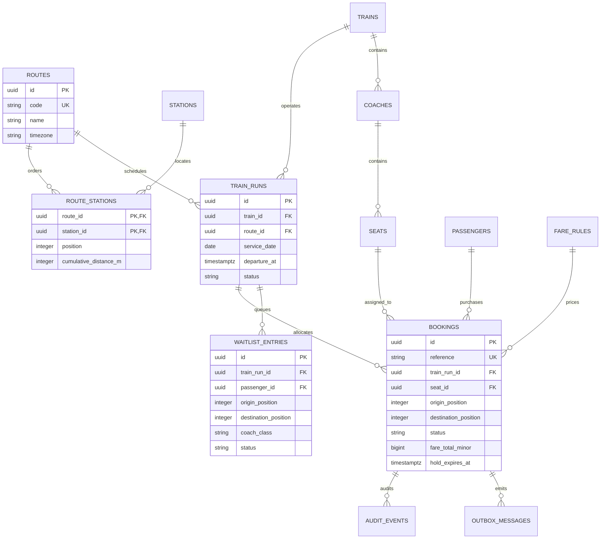
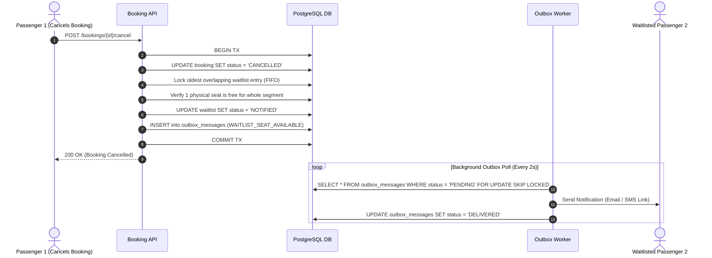

# Segment-Based Train Seat Booking System

[](https://go.dev/)
[](https://react.dev/)
[](https://www.typescriptlang.org/)
[](https://www.postgresql.org/)
[](https://www.docker.com/)
[](https://openapis.org/)
[](LICENSE)

An enterprise-grade, runnable reserved-seat booking system designed for Sri Lanka's **Colombo Fort – Badulla** main line. Featuring dynamic **segment-aware seat allocation**, **PostgreSQL GiST exclusion constraint safety**, **transactional outbox notifications**, **group reservations**, **segment waitlisting**, **PayHere payment sandbox integration**, and an interactive **React admin & passenger frontend**.

---

## Table of Contents

- [Problem & Solution](#problem--solution)
- [Key Features](#key-features)
- [Technology Stack](#technology-stack)
- [System Architecture](#system-architecture)
  - [High-Level Container View](#high-level-container-view)
  - [Monorepo Directory Structure](#monorepo-directory-structure)
  - [Database Schema & ER Diagram](#database-schema--er-diagram)
  - [Segment Allocation Math & GiST Exclusion](#segment-allocation-math--gist-exclusion)
  - [Concurrency & Overlap Prevention Flow](#concurrency--overlap-prevention-flow)
  - [Transactional Outbox & Waitlist Architecture](#transactional-outbox--waitlist-architecture)
- [API Reference](#api-reference)
- [Fare Calculation Engine](#fare-calculation-engine)
- [Local Setup & Quickstart](#local-setup--quickstart)
- [Development & Makefile Cheat Sheet](#development--makefile-cheat-sheet)
- [Testing & Quality Assurance](#testing--quality-assurance)
- [Security & Operations](#security--operations)
- [License & Disclaimer](#license--disclaimer)

---

## Problem & Solution

### The Inefficiency of Whole-Journey Reservations
Traditional train seat reservation systems lock a seat for the **entire journey duration** of a train run. If a passenger travels only from **Colombo Fort to Kandy**, conventional systems leave the physical seat vacant and unbookable from **Kandy to Badulla**, wasting significant rail capacity and revenue.

### Segment-Based Half-Open Intervals
This system solves the capacity problem by ordering stations along a route with zero-indexed positions and representing journey segments as half-open ranges: `[origin_position, destination_position)`.

```text
Colombo Fort (0) ─── Ragama (1) ─── Gampaha (2) ─── Peradeniya (3) ─── Kandy (4) ─── Nanu Oya (5) ─── Ella (6) ─── Badulla (7)
```

- **Colombo Fort → Kandy** occupies segment **`[0, 4)`**
- **Kandy → Badulla** occupies segment **`[4, 7)`**
- **Peradeniya Junction → Ella** occupies segment **`[3, 6)`**

#### Segment Conflict Matrix:
- `[0, 4)` and `[4, 7)` **Do NOT conflict**: Station index `4` (Kandy) is the handover point. The same physical seat can be booked by both passengers on the same train run!
- `[3, 6)` and `[0, 4)` **CONFLICT**: They overlap across interval `[3, 4)` (Peradeniya to Kandy).

A **PostgreSQL GiST Exclusion Constraint** natively guarantees that no two active bookings (`HELD` or `CONFIRMED`) can overlap for the same physical seat on the same train run.

---

## Key Features

### Passenger Capabilities
- **Segment-Aware Seat Map**: Interactive visual seat map allowing passengers to choose coach, class (1st Class Reserved, 2nd Class Reserved), and specific seat labels.
- **Advisory Availability Snapshot**: Instant API queries for available seats filtered by route, date, and origin/destination stations.
- **Group Bookings Aggregate**: Single-transaction aggregate reservation for **2 to 6 seats** with individual traveller assignments, unified reference, and atomic checkout.
- **Guest & Account Checkout**:
  - Fast **Guest Checkout** using contact details and reference verification.
  - **Passenger Accounts** with secure bcrypt authentication, HTTP-only SameSite cookies, saved traveller profiles, and private booking histories.
- **Ticket Credentials & Verification**: Privacy-preserving ticket verification lookup and digital credentials.
- **Segment Waitlist**: Automatic option to join a segment-aware waitlist when a journey is sold out. Receives FIFO notifications when cancellation frees inventory.

### Admin & Operational Features
- **Train Run Management**: Monitor utilization, capacity, departure schedules, and run statuses (`SCHEDULED`, `BOARDING`, `DEPARTED`, `COMPLETED`, `CANCELLED`).
- **Financial & Revenue Audits**: Real-time revenue reporting, itemized fare breakdowns, and refund tracking.
- **Transactional Outbox Telemetry**: Outbox message inspection, delivery retry controls, and failed notification monitoring.
- **Session-Based Security**: Protected Admin UI utilizing `ADMIN_API_KEY` stored securely in browser `sessionStorage`.

### Payment & Outbox Systems
- **Dual Payment Engine**:
  - Built-in **Zero-Config Simulator** for instant local testing.
  - **PayHere Sandbox Integration** with verified, replay-safe webhook callback handling (`MD5` secret signature validation).
- **Transactional Outbox Worker**: Reliable background worker delivering asynchronous events (hold expiry, waitlist notifications, SMS/Email alerts) without dual-write inconsistency.

---

## Technology Stack

| Layer | Technology | Purpose |
|---|---|---|
| **Backend API** | [Go 1.22+](https://go.dev/) + [Chi Router](https://github.com/go-chi/chi) | High-performance modular monolith REST API |
| **Database** | [PostgreSQL 17](https://www.postgresql.org/) + `btree_gist` | Primary datastore, transaction authority & range exclusion |
| **Migrations** | [Goose](https://github.com/pressly/goose) | Versioned SQL migration runner |
| **Frontend Web** | [React 18](https://react.dev/) + [TypeScript](https://www.typescriptlang.org/) + [Vite](https://vitejs.dev/) | Modern Single Page Application (SPA) |
| **State & Query** | [Redux Toolkit](https://redux-toolkit.js.org/) + [TanStack Query](https://tanstack.com/query) | Client-side state management & API caching |
| **Styling** | Vanilla CSS3 + Custom Design Tokens | Glassmorphic, responsive modern UI system |
| **Containerization** | Docker + Docker Compose v2 | Multi-container environment orchestration |
| **Testing** | Go `testing` + Vitest + React Testing Library + k6 | Unit, integration, concurrency, UI, and load testing |
| **Documentation** | OpenAPI 3.1 + Swagger UI + Mermaid | Standardized REST specification and system diagrams |

---

## System Architecture

### High-Level Container View



---

### Monorepo Directory Structure

```text
rail-seat-booking/
├── apps/
│   ├── api/                      # Go REST API Monolith
│   │   ├── cmd/server/           # Application entrypoint
│   │   ├── Dockerfile            # Multi-stage Go build container
│   │   └── internal/             # Domain & Infrastructure packages
│   │       ├── admin/            # Admin metrics & management logic
│   │       ├── availability/     # Advisory seat availability engine
│   │       ├── booking/          # Booking service & aggregate logic
│   │       ├── fare/             # Fare rule calculation engine
│   │       ├── journey/          # Train run & route management
│   │       ├── notification/     # Transactional outbox service
│   │       ├── passengerauth/    # Authentication & cookie sessions
│   │       ├── payment/          # PayHere & simulator payment handlers
│   │       ├── waitlist/         # Segment waitlist engine & FIFO queue
│   │       ├── database/         # DB connection pool & migrations
│   │       └── httpmiddleware/   # Request ID, CORS, Auth & Rate limiters
│   └── web/                      # React Passenger & Admin Web App
│       ├── Dockerfile            # Node/Vite build & Nginx container
│       └── src/
│           ├── components/       # UI Components & Interactive Seat Map
│           ├── store/            # Redux Slices (booking, auth, admin)
│           ├── sections/         # Page sections & views
│           └── api/              # OpenAPI client queries & mutations
├── database/                     # Database Schema & Seed Data
│   ├── migrations/               # Goose SQL migrations (00001..0000X)
│   ├── queries/                  # Parameterized SQL statements
│   └── seed/                     # Idempotent Colombo-Badulla demo seed
├── docs/                         # Architecture & Engineering Documentation
│   ├── adr/                      # Architectural Decision Records
│   ├── system-architecture.md    # Detailed topology & component boundaries
│   ├── database-design.md        # Relational catalog & constraint details
│   ├── concurrency-design.md     # GiST locking & race mitigation strategy
│   └── openapi.yaml              # OpenAPI 3.1 REST API specification
├── scripts/                      # Verification, linting & smoke test scripts
├── tests/                        # Cross-service integration & k6 load tests
├── compose.yaml                  # Multi-service Docker Compose configuration
├── Makefile                      # Developer command cheat sheet
└── README.md                     # Master documentation
```

---

### Database Schema & ER Diagram



---

### Segment Allocation Math & GiST Exclusion

To prevent race conditions across distributed API replicas, constraint enforcement is delegated directly to PostgreSQL using `btree_gist`:

```sql
-- PostgreSQL Exclusion Constraint DDL
CREATE EXTENSION IF NOT EXISTS btree_gist;

ALTER TABLE bookings
  ADD CONSTRAINT booking_positions_valid
    CHECK (origin_position >= 0 AND origin_position < destination_position),
  ADD CONSTRAINT prevent_overlapping_active_bookings
    EXCLUDE USING gist (
      train_run_id WITH =,
      seat_id WITH =,
      int4range(origin_position, destination_position, '[)') WITH &&
    ) WHERE (status IN ('HELD', 'CONFIRMED'));
```

#### Why `[)` Range Bounds?
- **Half-open interval `[0, 4)`**: Includes station 0, 1, 2, 3, but **excludes** station 4.
- **Interval `[4, 7)`**: Begins at station 4.
- **Intersection operator (`&&`)**: Evaluates `[0, 4) && [4, 7)` as **FALSE** (no overlap).
- **Overlapping query `[0, 4) && [3, 6)`**: Evaluates to **TRUE** (conflict on leg `[3, 4)`).

---

### Concurrency & Overlap Prevention Flow

```mermaid
sequenceDiagram
    autonumber
    actor ClientA as Passenger A (Colombo to Kandy)
    actor ClientB as Passenger B (Peradeniya to Ella)
    participant API as Go API Monolith
    participant DB as PostgreSQL Primary

    ClientA->>API: POST /bookings (Seat S1, range 0-4, Key K1)
    ClientB->>API: POST /bookings (Seat S1, range 3-6, Key K2)
    
    par Tx 1 Execution
        API->>DB: BEGIN TX 1; INSERT Booking A (range 0-4)
    and Tx 2 Execution
        API->>DB: BEGIN TX 2; INSERT Booking B (range 3-6)
    end

    note over DB: GiST Index evaluates range overlap between range 0-4 and range 3-6

    DB-->>API: TX 1 COMMITTED (201 Created)
    DB-->>API: TX 2 REJECTED: SQLSTATE 23P01 (Exclusion Violation)

    API-->>ClientA: 201 Created (Booking Reference Issued)
    API-->>ClientB: 409 Conflict (SEAT_NO_LONGER_AVAILABLE)
```

---

### Transactional Outbox & Waitlist Architecture



---

## API Reference

The full normative contract is defined in [`docs/openapi.yaml`](docs/openapi.yaml). An interactive Swagger UI is served locally at `http://localhost:8080/docs`.

### Core Endpoint Summary

| Domain | Method | Endpoint | Description | Auth / Headers |
|---|---|---|---|---|
| **System** | `GET` | `/health` | Liveness probe | None |
| **System** | `GET` | `/ready` | Readiness probe (DB ping check) | None |
| **Journeys** | `GET` | `/api/v1/routes` | List active rail routes & station sequences | None |
| **Journeys** | `GET` | `/api/v1/train-runs` | Query train runs by date and route | None |
| **Availability**| `GET` | `/api/v1/availability` | Query advisory available seat map | None |
| **Fares** | `GET` | `/api/v1/fares/quote` | Calculate real-time fare quote | None |
| **Bookings** | `POST` | `/api/v1/bookings` | Create single seat booking (`HELD` or `CONFIRMED`) | `Idempotency-Key` |
| **Bookings** | `POST` | `/api/v1/bookings/group` | Create group booking (2–6 seats aggregate) | `Idempotency-Key` |
| **Bookings** | `GET` | `/api/v1/bookings/{id}` | Fetch booking details by UUID or reference | Reference / Auth |
| **Bookings** | `POST` | `/api/v1/bookings/{id}/cancel`| Cancel booking & trigger waitlist outbox | Reference / Auth |
| **Waitlist** | `POST` | `/api/v1/waitlist` | Join waitlist for sold-out journey segment | Passenger Auth |
| **Waitlist** | `DELETE`| `/api/v1/waitlist/{id}` | Self-service waitlist entry cancellation | Passenger Auth |
| **Auth** | `POST` | `/api/v1/auth/login` | Login passenger & issue HTTP-only cookie | None |
| **Auth** | `POST` | `/api/v1/auth/logout` | Revoke session & clear auth cookie | Cookie |
| **Payment** | `POST` | `/api/v1/webhooks/payhere`| PayHere Sandbox IPN webhook callback | MD5 Signature |
| **Admin** | `GET` | `/api/v1/admin/metrics` | Retrieve train run utilization & outbox status| `X-Admin-API-Key` |

---

## Fare Calculation Engine

Fares are dynamically calculated using integer minor units (LKR cents) to eliminate floating-point precision errors:

$$\text{Distance (km)} = \frac{\text{Destination Cumulative Distance (m)} - \text{Origin Cumulative Distance (m)}}{1000}$$

$$\text{Subtotal} = \text{Base Fee} + (\text{Distance (km)} \times \text{Rate Per Km})$$

$$\text{Class Adjusted Subtotal} = \text{Subtotal} \times \left( \frac{\text{Class Multiplier Basis Points}}{10000} \right)$$

$$\text{Final Fare} = \max(\text{Minimum Fare}, \text{Class Adjusted Subtotal})$$

### Immutable Calculation Snapshot
When a booking is created, the full calculation inputs, effective `fare_rule_id`, breakdown breakdown object, currency scale, and final total are snapshot directly into the `bookings` row. Future fare rule or distance updates will **never** distort historical transaction receipts or refund calculations.

---

## Local Setup & Quickstart

### Prerequisites
- **Docker Desktop** or **Docker Engine with Compose v2** (Recommended 4GB+ RAM allocated)
- **Make** (optional, for developer helper commands)

### Step-by-Step Installation

1. **Clone the repository**:
   ```bash
   git clone https://github.com/lahiruudayakumara/rail-seat-booking.git
   cd rail-seat-booking
   ```

2. **Configure environment variables**:
   ```bash
   cp .env.example .env
   ```

3. **Launch system via Docker Compose**:
   ```bash
   docker compose up --build
   ```

4. **Access Running Services**:

   | Service | URL / Destination | Details |
   |---|---|---|
   | **Passenger Web Application** | [http://localhost:3000](http://localhost:3000) | Booking flow, seat map & account management |
   | **Admin Dashboard** | [http://localhost:3000/admin](http://localhost:3000/admin) | Operational metrics (`ADMIN_API_KEY` login) |
   | **Go REST API** | [http://localhost:8080](http://localhost:8080) | Backend REST API server |
   | **OpenAPI / Swagger UI** | [http://localhost:8080/docs](http://localhost:8080/docs) | Interactive API documentation |
   | **PostgreSQL Database** | `localhost:5432` | Container service `db` |

> **Startup Sequence**: Docker Compose waits for PostgreSQL to pass healthchecks, applies Goose SQL migrations, seeds idempotent Colombo Fort–Badulla demo data, launches the API, and finally serves the React application.

---

## Development & Makefile Cheat Sheet

The repository includes a comprehensive [`Makefile`](file:///Users/lahiruudayakumara/rail-seat-booking/Makefile) to streamline daily development:

```bash
# Manage Container Environment
make up                # Build and start all services in Docker
make down              # Stop all running containers
make reset             # Destroy volumes, re-migrate, re-seed & restart clean
make logs              # Tail aggregated logs (api, web, db, migrate)
make seed              # Re-run idempotent demonstration SQL seed

# Database Migrations
make migrate-up        # Run pending Goose database migrations
make migrate-down      # Roll back last Goose migration
make migration-status  # Check current migration schema state

# Testing & Quality Assurance
make test              # Run full test suite (Go + React Vitest)
make test-go           # Run Go unit and race-detector tests (-race)
make test-web          # Run React component & store tests via Vitest
make verify            # Run full script verification pipeline
make smoke             # Execute end-to-end HTTP smoke test suite
make integration       # Run single-seat booking integration test flow
make integration-group # Run multi-seat group booking integration flow
make load              # Run k6 concurrent seat contention load test
```

---

## Testing & Quality Assurance

The system is validated through a multi-tiered testing strategy:

1. **Go Race & Unit Testing**:
   Executes concurrent goroutine tests against test database containers to verify that `23P01` exclusion violations map reliably to HTTP `409 Conflict` without deadlocks.
   ```bash
   make test-go
   ```

2. **Frontend Vitest & RTL**:
   Validates React state slices, seat selection logic, form validation, and component rendering.
   ```bash
   make test-web
   ```

3. **End-to-End Smoke & Integration Flow**:
   Automated bash test scripts verify health endpoints, fare quotes, seat holds, payment callbacks, ticket lookup, and cancellations.
   ```bash
   make smoke
   make integration
   ```

4. **k6 Concurrency Load Test**:
   Simulates 50+ concurrent virtual users attempting to book overlapping seat segments simultaneously to verify zero double-booking occurrences under heavy load.
   ```bash
   make load
   ```

---

## Security & Operations

- **Parameterize All SQL**: Built exclusively with parameterized queries via `pgx` to prevent SQL injection vulnerabilities.
- **Least-Privilege Database User**: Application connects as restricted `rail_app` user; table modifications and migration privileges are isolated.
- **HTTP-Only SameSite Cookies**: Passenger authentication tokens are delivered in secure, HTTP-only, SameSite cookies to mitigate XSS and CSRF risks.
- **Bcrypt Password Hashing**: Passenger account passwords are stored using bcrypt with work factor 12.
- **Idempotent Webhooks**: PayHere Sandbox webhook receiver verifies `md5(merchant_id + order_id + payhere_amount + payhere_currency + status_code + md5(merchant_secret))` before updating payment state.
- **Append-Only Auditing**: Every state-changing operation writes to an append-only `audit_events` ledger for operational compliance.

---

## License & Disclaimer

- **License**: Released under the [MIT License](LICENSE).
- **Data Disclaimer**: Station schedules, distances, train numbers, and fare rates included in demonstration seed data are illustrative for software testing purposes and **do not represent official Sri Lanka Railways operational data**.
