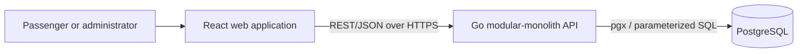

# Segment-Based Train Seat Booking System

A runnable reserved-seat booking application for Sri Lanka's Colombo Fort–Badulla line. A physical seat can be sold again after its passenger leaves, while PostgreSQL remains the final authority preventing overlapping sales. Demonstration schedules, distances and fares are illustrative—not official Sri Lanka Railways data.

## Problem and solution

Whole-journey allocation wastes capacity. This system assigns every route station an ordered position and occupies the half-open segment `[origin, destination)`. Thus Colombo Fort → Kandy `[0,4)` and Kandy → Badulla `[4,7)` may share a seat; Peradeniya Junction → Ella `[3,6)` conflicts with `[0,4)`. A PostgreSQL GiST exclusion constraint atomically enforces this rule per train run and seat.

## Main features

- Configurable routes, ordered stations, distances, trains, runs, coaches, layouts, seats, and fares
- Segment-aware availability, fare quotes, booking lookup, cancellation, references, and audit events
- Idempotent booking creation and database-safe concurrency
- Responsive, accessible booking flow and an OpenAPI 3.1 contract
- Interactive coach-by-coach seat map with conflict recovery
- UTC persistence with `Asia/Colombo` schedule presentation

The initial scope uses direct confirmation without payment. `HELD` and `CONFIRMED` block inventory; `CANCELLED`, `EXPIRED`, and `COMPLETED` do not.

## Technology

Go, Chi, pgx, Goose, PostgreSQL, OpenAPI 3.1 and `slog`; React, TypeScript, Vite and TanStack Query; Docker Compose, GitHub Actions and Make; Go tests plus Vitest and React Testing Library.

## Architecture



The API validates and orchestrates; PostgreSQL owns durable integrity. Optional reverse proxy, Redis, queue, notifications, object storage and monitoring are future production components—not initial dependencies. See [system architecture](docs/system-architecture.md), [database design](docs/database-design.md), and [ADRs](docs/adr/).

## Local setup

Docker Desktop or Docker Engine with Compose v2 is the only runtime prerequisite. From a clean machine:

```bash
git clone <repository-url>
cd segment-train-booking
cp .env.example .env
docker compose up --build
```

Expected services:

| Service | URL |
|---|---|
| API | http://localhost:8080 |
| OpenAPI/Swagger | http://localhost:8080/docs |
| PostgreSQL | Internal Compose service `db:5432` |

Docker Compose waits for PostgreSQL, applies Goose migrations, loads idempotent demonstration data, starts the API, and finally starts the web application. Full instructions are in [local development](docs/local-development.md).

Environment values are documented in `.env.example` using safe local placeholders only. Secrets must never be committed. Useful commands are `make verify`, `make smoke`, `make integration`, `make seed`, `make logs`, `make down`, and `make reset`.

## API and behavior

The normative contract is [docs/openapi.yaml](docs/openapi.yaml); endpoint semantics and errors are in [API design](docs/api-design.md). The API serves a documentation landing page at `/docs` and the specification at `/openapi.yaml`.

Fare is `base_fee + travelled_distance × class_rate`, subject to configured minimums and multipliers. Money is integer LKR minor units and each booking stores an immutable fare snapshot; see [fare design](docs/fare-design.md).

Availability is advisory. Booking insertion occurs in a transaction; if concurrent requests overlap, the exclusion constraint lets one commit and maps the loser to `409 SEAT_NO_LONGER_AVAILABLE`. Idempotency keys make safe retries return the original result.

## Monorepo

```text
apps/api/                 Go API
apps/web/                 React application
database/                 Goose migrations, sqlc queries, demo seed
docs/                     product and engineering documentation
scripts/                  developer/CI helpers
tests/                    cross-service integration and load tests
examples/api/             runnable HTTP request examples
.github/workflows/        validation and optional release workflows
```

The API is split by business capability, with handler, service, repository, and model boundaries where useful. Shared configuration, HTTP conventions, middleware, and database interfaces live in dedicated infrastructure packages. See [backend architecture](docs/backend-architecture.md) for the exact package tree and dependency rules.

Operational procedures are in [runbooks](docs/runbooks/), while cross-service test prerequisites are documented in [tests](tests/README.md). See [project structure](docs/project-structure.md) and [implementation plan](docs/implementation-plan.md).

## Design decisions and alternatives

- **Half-open station ranges:** `[origin,destination)` represents travelled legs and permits an exact station handover. Closed ranges would incorrectly conflict at Kandy; per-leg rows would multiply writes and complicate atomic acquisition.
- **PostgreSQL exclusion constraint:** a partial GiST constraint on run, seat and range protects every writer and API replica. Application-only checks and process mutexes race; Redis locks add lease/fencing failure modes; `SELECT FOR UPDATE` has no row to lock when availability is represented by absence.
- **Modular monolith:** one Go API keeps booking, fare and audit writes in one local transaction. Microservices or event-driven booking would add network failure and eventual-consistency costs before scale justifies them.
- **Explicit parameterized SQL with pgx:** locking and range behavior remain visible. A general ORM would save CRUD code but obscure the critical database-specific invariant; sqlc is configured as a possible next hardening step but is not required by the current runtime.
- **REST/OpenAPI:** inspectable HTTP semantics and generated-client support were favored over GraphQL's additional resolver and caching surface.

Full trade-offs are recorded in [docs/adr](docs/adr/).

## Challenges encountered

The hardest part is not displaying availability but committing it correctly after that display becomes stale. The system treats availability as advisory and maps PostgreSQL exclusion violation `23P01` to a stable `409`. Other challenges include exact integer fare rounding, idempotent retry behavior, route-order validation, dynamic demonstration dates, and deterministic startup through health-gated migration and seed jobs.

## Security, operations, and quality

Secure defaults include parameterized SQL, strict validation, least-privilege DB roles, TLS in production, limited CORS, rate limits, redacted structured logs, protected booking references and append-only audits. See [security](docs/security.md), [observability](docs/observability.md), [testing](docs/testing-strategy.md), [CI/CD](docs/ci-cd.md), and [deployment](docs/deployment.md).

## Limitations and future work

Initial scope excludes payment capture, authentication implementation, waitlists, notifications, real-time push, multi-seat/group atomic booking, live railway feeds, refunds and production cloud deployment. The implemented extra-credit feature is a responsive seat-map visualization with explicit 409 conflict recovery that refreshes seats while preserving passenger form data. Candidate future extras include holds, admin/revenue analytics, waitlists, WebSocket/SSE updates, multilingual UX and verified official schedules/fares.

## License

MIT; see [LICENSE](LICENSE). Production ownership and third-party-data terms must be confirmed before launch.
