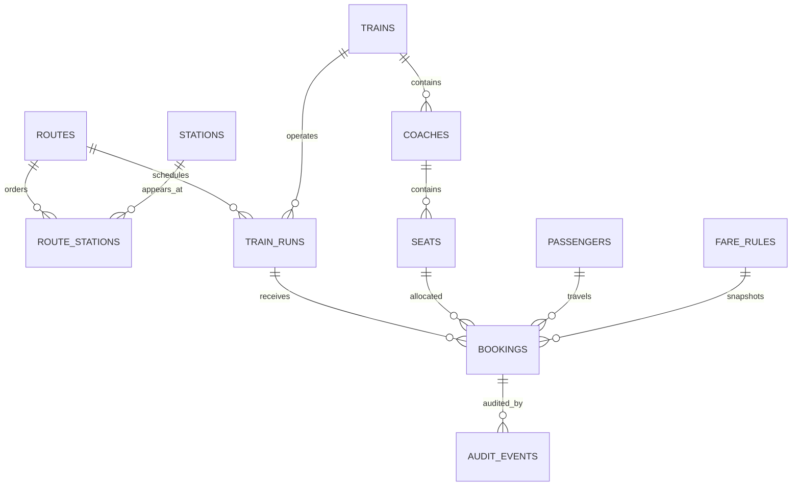

# Database Design

## Conventions

PostgreSQL 16+, `uuid` primary keys generated by the application (UUIDv7 preferred when library support is mature), `timestamptz` UTC instants, `date` service dates, snake_case names and explicit foreign keys. Money uses `bigint` minor units: it is exact, fast, currency-agnostic and prevents floating-point errors. LKR currently has two decimal minor units; `currency char(3)` and `currency_scale smallint` make the snapshot explicit.

Use constrained text or PostgreSQL enums only when migration costs are accepted; initial DDL may use text checks for evolving statuses. Enable `btree_gist`. All mutable rows have `created_at`, `updated_at`; audit events are append-only.

## Relational model



## Table catalogue

Common timestamps are omitted from repeated rows below but are non-null with `now()` defaults unless stated.

### `routes`

| Column | Type/null/default | Constraints/purpose |
|---|---|---|
| `id` | uuid, not null | PK |
| `code` | varchar(32), not null | Unique stable external code |
| `name`, `direction` | text, not null | Display name/direction |
| `timezone` | text, not null, `'Asia/Colombo'` | IANA timezone |
| `active` | boolean, not null, true | Operational enablement |

Indexes: unique `code`; partial active-list index on `(name) WHERE active`.

### `stations`

`id uuid PK`; `code varchar(16) UNIQUE NOT NULL`; `name text NOT NULL`; optional `name_si`, `name_ta`; `timezone text NOT NULL DEFAULT 'Asia/Colombo'`; `active boolean NOT NULL DEFAULT true`. Index normalized display name for search; do not store secrets.

### `route_stations`

| Column | Type/null | Constraints/purpose |
|---|---|---|
| `route_id` | uuid, not null | FK routes, composite PK |
| `station_id` | uuid, not null | FK stations, composite PK |
| `position` | integer, not null | `>=0`, unique per route |
| `cumulative_distance_m` | integer, not null | `>=0`; app/migration validates strict increase |
| `arrival_offset_minutes`, `departure_offset_minutes` | integer, nullable | Schedule template placeholders |

Indexes: unique `(route_id, position)` for ordering; `(station_id, route_id)` for membership. Referenced route versions should not be edited destructively.

### `trains`, `coaches`, `seats`

`trains`: `id uuid PK`, `code varchar(32) UNIQUE NOT NULL`, `name text NOT NULL`, `active boolean DEFAULT true`.

`coaches`: `id uuid PK`, `train_id uuid FK NOT NULL`, `code varchar(16) NOT NULL`, `sequence smallint NOT NULL CHECK >0`, `coach_class text NOT NULL`, `reservation_type text NOT NULL CHECK IN ('RESERVED','UNRESERVED')`, `layout_code text`, `active boolean DEFAULT true`; unique `(train_id,code)` and `(train_id,sequence)`; index `(train_id,reservation_type,active)`.

`seats`: `id uuid PK`, `coach_id uuid FK NOT NULL`, `label varchar(16) NOT NULL`, `row_number smallint`, `column_code varchar(8)`, `attributes jsonb NOT NULL DEFAULT '{}'`, `active boolean DEFAULT true`; unique `(coach_id,label)`; index `(coach_id,active)`. Validate attributes against an application schema. Referenced coaches/seats are disabled, not deleted.

### `train_runs`

| Column | Type/null/default | Constraints/purpose |
|---|---|---|
| `id` | uuid, not null | PK |
| `train_id`, `route_id` | uuid, not null | FKs; configured equipment and route version |
| `service_date` | date, not null | Local service date |
| `departure_at`, `arrival_at` | timestamptz, not null | UTC instants; departure < arrival |
| `status` | text, not null, `'SCHEDULED'` | Check scheduled lifecycle |

Indexes: `(service_date,route_id,status)`, `(route_id,departure_at)`, `(train_id,departure_at)`; optional uniqueness matching the operator's run number/schedule key.

### `passengers`

`id uuid PK`; `full_name text NOT NULL`; `email_normalized text`; `phone_e164 text`; optional encrypted/raw contact columns or token references; `data_retention_until timestamptz`. Index hashed/normalized lookup only if operationally required. Avoid broad soft deletion: anonymize PII after retention while preserving financial/audit facts.

### `fare_rules`

`id uuid PK`; `route_id uuid FK NOT NULL`; `coach_class text NOT NULL`; `currency char(3) NOT NULL`; `currency_scale smallint NOT NULL DEFAULT 2`; `base_fee_minor bigint NOT NULL CHECK >=0`; `rate_per_km_minor bigint NOT NULL CHECK >=0`; `minimum_fare_minor bigint NOT NULL CHECK >=0`; `class_multiplier_basis_points integer NOT NULL DEFAULT 10000 CHECK >0`; `effective_from date NOT NULL`; `effective_to date`; `priority integer DEFAULT 0`; `active boolean DEFAULT true`; check `effective_to IS NULL OR effective_to > effective_from`. Index `(route_id,coach_class,effective_from,effective_to) WHERE active`; migration/service must prevent ambiguous equal-priority effective rules.

### `bookings`

| Column | Type/null/default | Constraints/purpose |
|---|---|---|
| `id` | uuid, not null | PK |
| `reference` | varchar(24), not null | Unique random reference; case normalized |
| `train_run_id`, `seat_id`, `passenger_id` | uuid, not null | FKs |
| `origin_station_id`, `destination_station_id` | uuid, not null | FKs and audit-friendly endpoints |
| `origin_position`, `destination_position` | integer, not null | Check `0 <= origin < destination`; immutable after acquisition |
| `status` | text, not null | Check six documented values |
| `hold_expires_at` | timestamptz, nullable | Required only for `HELD` |
| `fare_rule_id` | uuid, nullable | FK; rule may be retired |
| `fare_total_minor` | bigint, not null | Check `>=0`; immutable snapshot |
| `fare_currency` | char(3), not null | Snapshot |
| `fare_currency_scale` | smallint, not null, 2 | Snapshot |
| `fare_breakdown` | jsonb, not null | Versioned calculation inputs/results |
| `confirmed_at`, `cancelled_at`, `completed_at` | timestamptz, nullable | State evidence |
| `version` | bigint, not null, 1 | Optimistic status update support |

Indexes: unique `reference`; `(train_run_id,seat_id,status)` partial for blocking states; `(train_run_id,origin_position,destination_position)`; `(passenger_id,created_at DESC)`; `(created_at DESC)`; `(status,hold_expires_at) WHERE status='HELD'`.

The initial BookingSegment value object is stored in these booking columns. A generated range column is optional; the expression below is explicit and easy to audit.

```sql
CREATE EXTENSION IF NOT EXISTS btree_gist;

ALTER TABLE bookings
  ADD CONSTRAINT booking_positions_valid
    CHECK (origin_position >= 0 AND origin_position < destination_position),
  ADD CONSTRAINT prevent_overlapping_active_bookings
    EXCLUDE USING gist (
      train_run_id WITH =,
      seat_id WITH =,
      int4range(origin_position, destination_position, '[)') WITH &&
    ) WHERE (status IN ('HELD', 'CONFIRMED'));
```

The constraint is necessary because an application `SELECT` followed by `INSERT` races across transactions/replicas. GiST predicate locking and the exclusion check cause incompatible concurrent inserts to wait or fail with SQLSTATE `23P01`; only a compatible commit survives. `[)` means `[0,4)` and `[4,7)` share no integer leg and are adjacent, while `[0,4)` and `[3,6)` overlap. Including `train_run_id` isolates dates/services. Updating to `CANCELLED`/`EXPIRED` removes the row from the partial predicate immediately on commit; `COMPLETED` stays historical and non-blocking.

### `idempotency_keys`, `audit_events`, and payment placeholder

`idempotency_keys`: `(scope,key_hash)` PK/unique, `request_hash`, `state IN_PROGRESS|COMPLETED`, nullable `booking_id`, response status/body, `expires_at`, timestamps. Never store raw bearer-like keys. A transaction reserves the key; reuse with another request hash is a conflict.

`audit_events`: `id uuid PK`, `aggregate_type text`, `aggregate_id uuid`, `event_type text`, optional `actor_type/actor_id`, `request_id uuid`, `occurred_at timestamptz DEFAULT now()`, `before_state jsonb`, `after_state jsonb`, `metadata jsonb`; index `(aggregate_type,aggregate_id,occurred_at)`, `(request_id)`, `(occurred_at)`. Revoke UPDATE/DELETE from the runtime role.

Future `payments`: `id uuid PK`, `booking_id uuid FK`, `provider`, `provider_reference`, `status`, amount/currency snapshot, timestamps; unique provider reference. No payment implementation initially.

## Availability query shape

Select active seats joined to active `RESERVED` coaches belonging to the run's train, and reject a seat where `EXISTS` a booking on the run with blocking status and `int4range(...) && int4range($origin,$destination,'[)')`. Resolve both positions from `route_stations` in the same primary-DB request. Indexes support filtering; the exclusion constraint is still the commit guarantee.

## Deletion, migration, backup

Use hard delete for erroneous unreferenced seed/config rows only. Disable referenced routes/trains/coaches/seats/rules; cancel runs/bookings through state transitions; anonymize passengers by policy. Migrations are forward-only in production, transactional where PostgreSQL permits, with expand/migrate/contract for zero downtime. Test upgrade from an empty and previous production-like database, take encrypted backups, and regularly prove point-in-time restore.

## Demonstration seed design

The seed is deterministic and idempotent, and every displayed distance/fare is labelled **demonstration data—not official Sri Lanka Railways data**.

| Position | Station | Demo cumulative km |
|---:|---|---:|
| 0 | Colombo Fort | 0 |
| 1 | Ragama | 14 |
| 2 | Gampaha | 28 |
| 3 | Peradeniya Junction | 115 |
| 4 | Kandy | 120 |
| 5 | Nanu Oya | 207 |
| 6 | Ella | 271 |
| 7 | Badulla | 292 |

Seed route `CF-BD-UP`; one active demo train; several future runs generated from a documented anchor date; reserved coaches `R1`/`R2`/`R3` with configurable First/Second-class layouts; unreserved `U1`–`U5`; seats generated from layout configuration with stable UUIDs; and at least two LKR fare rules illustrating class differences. No query or service may assume those counts, labels or rates. Tests use dedicated fixture factories rather than depending on wall-clock seed runs.

Configuration values also include station order/distance, reservation type, coach class, layouts/seat labels, base/rate/minimum/currency, booking horizon, hold duration and service timezone. Operational changes are validated, audited and effective-dated/versioned where they could change historical interpretation.
