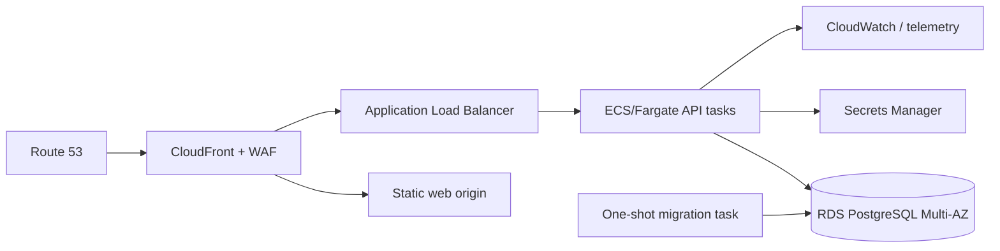

# Deployment

Cloud deployment is not required for the assignment. The initial deliverable target is local Compose:

```bash
docker compose up --build
```

Web listens on 3000, API on 8080 and PostgreSQL on 5432. Compose will use a persistent named DB volume, health checks, dependency health conditions, an explicit one-shot migration service and opt-in idempotent seed service. `depends_on` ordering alone is insufficient; API readiness waits for schema compatibility.

Go and frontend images use multi-stage builds, pinned base digests/tags, reproducible dependency installs, small runtime stages, non-root users, no build tools/secrets in runtime and OCI metadata. The frontend may be served by an unprivileged web server; the API handles graceful SIGTERM. Schema migration is a release job, not every replica racing at boot. Back up before risky migrations and prefer expand/migrate/contract.

## Future AWS reference



Use private subnets/security groups, TLS/ACM, least-privilege task roles, autoscaling on latency/CPU, RDS encryption/PITR, separate migration role, centralized logs/alerts and tested rollback. CloudFront serves the SPA and optionally fronts APIs; ALB health uses readiness appropriately. Route 53 supplies DNS. Secrets Manager rotates credentials; CloudWatch is one monitoring option.

Railway, Render or Fly.io can host a demonstration with less operational work, provided managed PostgreSQL, TLS, persistent data, migrations, backups and secret injection are configured. They are not substitutes for documented recovery/security checks. Promotion path: validate immutable images → backup/compatibility check → migrate → rolling/canary API → smoke tests → frontend → monitor; roll application back only when schema remains backward-compatible.
