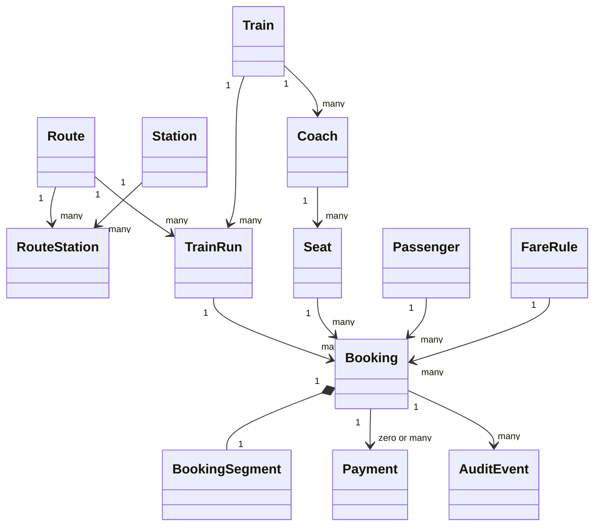

# Domain Model

## Model and distinctions

A **Route** is an ordered calling pattern; a **Train** is reusable rolling-stock configuration; a **TrainRun** is that train operating one route at a dated time. A **Coach** contains physical **Seats**. A **Booking** is the commercial record; its **BookingSegment** is the occupied interval. A physical seat has no global available flag—availability is derived for a train run and requested interval.

## Entity catalogue

| Entity | Purpose and important fields | Relationships/constraints | Lifecycle and example |
|---|---|---|---|
| Route | `id`, `code`, `name`, `direction`, `active` | Unique code; owns ordered route stations/runs | Draft/admin configured → active → inactive; `CF-BD-UP` |
| Station | `id`, `code`, names, timezone, active | Unique code; reusable across routes | Active/inactive; `KDY`, Kandy |
| RouteStation | `route_id`, `station_id`, `position`, `cumulative_distance_m` | Unique route+station and route+position; nonnegative, strictly increasing distance | Changed through versioned route configuration; Kandy position 4 |
| Train | `id`, `code`, `name`, active | Unique code; owns coaches | Active/inactive; `UDR-001` |
| TrainRun | `id`, train/route IDs, departure/arrival instants, `service_date`, status | Unique scheduled occurrence; departure < arrival | `SCHEDULED→BOARDING→DEPARTED→COMPLETED` or cancelled |
| Coach | `id`, train ID, code, sequence, class, reservation type, active | Unique sequence/code per train | Configured/disabled; `R1`, `FIRST`, `RESERVED` |
| Seat | `id`, coach ID, label, row/column/attributes, active | Unique label per coach | Enabled/disabled; `12A`, window |
| Passenger | `id`, name, email/phone (normalized/protected), created time | One passenger may have bookings; retention policy applies | Created/updated/anonymized; example data is synthetic |
| Booking | IDs for run/seat/passenger/endpoints, reference, status, positions, fare snapshot, times, idempotency data | Origin < destination; exclusion on active interval; immutable run/seat/endpoints after confirm | Direct confirm, cancel, complete; `BK-7J4M9Q2X` |
| BookingSegment | Value object/projection: origin/destination IDs and positions, `int4range` | Exactly one initial segment per booking; `[0,4)` | Immutable after inventory acquisition |
| FareRule | route/class, base/rate/minimum/multiplier, currency, effective range, priority | Valid values; at most one winning rule | Draft/effective/retired; demo LKR rule |
| Payment | Future adapter record: provider ref, amount, status | Must not determine inventory without booking transaction policy | Placeholder only; authorized/captured/refunded |
| AuditEvent | aggregate/type/id, action, actor, request ID, before/after metadata, UTC time | Append-only; metadata excludes secrets | Retained per policy; `BOOKING_CANCELLED` |

BookingSegment can be represented in the initial relational schema directly on `bookings` to keep the exclusion constraint simple. It remains a named domain value object. A future multi-leg/group order may introduce `booking_segments`, but every inventory row needs its own exclusion constraint and transaction semantics.

## Aggregate boundaries

- **Route aggregate:** route plus ordered route stations; changes validate unique/increasing positions and distances. Existing bookings retain positions/snapshots, so schedule-affecting edits create versions rather than rewrite history.
- **Train aggregate:** train, coaches and seats; configuration edits cannot silently invalidate departed/history records. Disable instead of delete referenced inventory.
- **TrainRun aggregate:** schedule/status referencing immutable route/train versions. It does not own all bookings in memory.
- **Booking aggregate:** booking, segment, passenger reference, fare snapshot and status transitions. It is the transaction consistency boundary with audit/idempotency records.
- **FareRule aggregate:** effective-dated rule. The quote service selects it; booking stores an immutable snapshot.

Cross-aggregate invariants that are unsafe in memory—especially overlap—are enforced by database keys, checks and exclusion constraints. Services coordinate aggregates but do not pretend a process-local lock protects multiple API replicas.
