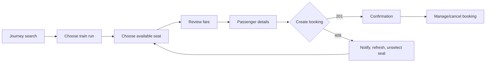

# Frontend Architecture

## Pages and features

| Route | Responsibility |
|---|---|
| `/` | Product entry and journey CTA |
| `/search` | Journey form and train-run-selection results |
| `/train-runs/:trainRunId/seats` | seat-availability, seat-map and fare-quote |
| `/booking` | passenger-details and final review; route state is recoverable/validated |
| `/booking/:bookingId/confirmation` | booking-confirmation/reference |
| `/manage-booking` | Protected reference lookup and booking-management |
| `/admin` | Future authenticated admin-dashboard placeholder |
| `/account` | Optional passenger registration/login and private booking history |

Use feature folders `journey-search`, `train-run-selection`, `seat-availability`, `seat-map`, `fare-quote`, `passenger-details`, `booking-confirmation`, `booking-management`, and `admin-dashboard`. Each owns UI, Zod schemas, hooks and tests. Shared primitives live in `components/ui`; generated API types/client live in `packages`.

## State ownership

TanStack Query owns server state: routes, runs, availability, quotes and bookings. URL search parameters own shareable journey criteria. React Hook Form owns unsubmitted passenger data with Zod validation matching the OpenAPI contract. Local component state owns visual seat focus/selection. Do not duplicate server collections into a global store. Sensitive passenger values are not persisted to local storage or analytics. Passenger authentication state is recovered through an HTTP-only session cookie; JavaScript never receives the session credential.

Query keys include all semantic inputs, e.g. `['seat-map',runId,originId,destinationId,class]`. After booking or cancellation invalidate the seat map for the affected run/segment and the booking query. Quotes have explicit expiry and are never treated as seat holds.

## Interaction states

Show skeletons without shifting layout, disable only the submitting action, and announce progress through `aria-live`. Empty states distinguish “no trains,” “no seats for this segment/class,” and filter errors. Error boundaries handle unexpected rendering faults; API errors map by stable `code`. GET retries use bounded exponential backoff for transient network/5xx errors; never automatically retry booking mutation unless replaying the same idempotency key, and never automatically retry a 409.

On `409 SEAT_NO_LONGER_AVAILABLE`: stop loading, show a plain-language notification, invalidate/refetch availability, unselect the now-unavailable seat, retain passenger form data in memory, focus the seat-map message and suggest other seats. If none remain, offer return to run selection.

## Seat map, accessibility, responsive design

Render coaches from API layout metadata, never assumed counts. Every seat is a semantic button with label, class and availability text; disabled seats are not focusable/selectable but remain understandable. Support keyboard arrows within a grid, Enter/Space selection, visible focus, 44px touch targets, text/icons in addition to color, logical tab order, reduced motion and screen-reader summaries. On narrow screens show one coach with sticky fare/continue controls; on larger screens show overview plus details. WCAG 2.2 AA contrast and automated/manual testing are release criteria.

The generated OpenAPI client centralizes base URL, JSON decoding, request ID and error-envelope handling. Abort stale requests on route/filter changes. Error messages never reveal whether a protected booking reference exists.
