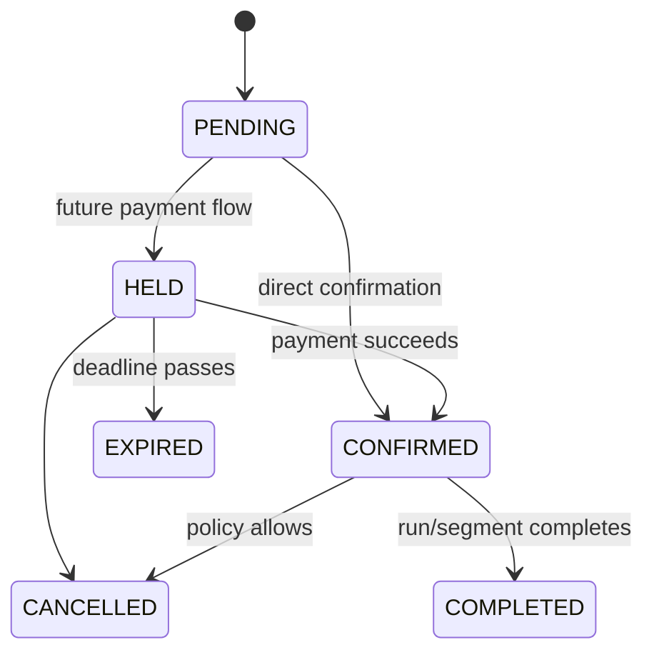

# Requirements

## Scope and roles

The initial product lets a **passenger/guest** search and manage a reservation using a protected reference; an **administrator** configures inventory and service data (admin APIs/UI are a later increment); an **operator/support user** may view audited booking state in a future authenticated console; and an **automated expiry worker** will expire holds when holds are enabled.

### Assumptions and constraints

- One direction is modeled as an ordered route; the reverse service is a separate route ordering.
- A train run is one dated occurrence of a train on a route. Schedules display in `Asia/Colombo`; instants persist in UTC.
- Initial bookings contain one passenger and one seat. LKR demo fares/distances are not official.
- Eight coaches (three reserved, five unreserved) are seed configuration, never code constants.
- PostgreSQL is required because range exclusion is the integrity boundary. The initial architecture is a modular monolith.
- Payment, identity, refunds, live operational feeds and production deployment are outside initial scope.

## Functional requirements

| ID | Requirement |
|---|---|
| FR-01 | List active routes/stations and ordered stations with cumulative distance. |
| FR-02 | Accept origin/destination only when both belong to the selected route and origin precedes destination. |
| FR-03 | Find future train runs by date, route and journey endpoints. |
| FR-04 | List enabled seats in reservable coaches that are free for the requested segment and optional class. |
| FR-05 | Display a seat-level, expiring fare quote and its currency/breakdown. |
| FR-06 | Create a booking with passenger details, train run, seat, endpoints, quote and idempotency key. |
| FR-07 | Generate a unique, high-entropy, human-usable booking reference. |
| FR-08 | Fetch by UUID for authenticated/internal use and by reference plus verification factor for guests. |
| FR-09 | Cancel an eligible `HELD`/`CONFIRMED` booking idempotently and audit the transition. |
| FR-10 | Reject same-run, same-seat overlapping active segments while allowing adjacent segments. |
| FR-11 | Configure routes, station order/distance, trains, runs, coaches, seats/layouts and fare rules. |
| FR-12 | Manage `PENDING`, `HELD`, `CONFIRMED`, `CANCELLED`, `EXPIRED`, `COMPLETED`. |

`HELD` and `CONFIRMED` block. `PENDING` never owns inventory; it is transient/pre-validation. `CANCELLED`, `EXPIRED`, and `COMPLETED` release it. Direct `PENDING → CONFIRMED` is the initial no-payment path. Future payment uses `PENDING → HELD → CONFIRMED`; hold expiry is `HELD → EXPIRED`.

## Business rules

1. Occupancy is `[origin_position,destination_position)`; adjacency has no shared travelled leg.
2. A seat is unavailable only for the same run, same physical seat, overlapping range, and blocking status.
3. A seat and its coach must be enabled and coach reservation type must be `RESERVED`.
4. Runs in the past/cancelled runs are not bookable; endpoints must be served by that run's route.
5. Fare is calculated server-side from the effective rule and stored as a snapshot in integer minor units.
6. Availability never guarantees purchase; booking commit does. Client retries require the same idempotency key and payload.
7. Cancellation does not delete history; it changes state and records an audit event. `COMPLETED` remains reportable but cannot conflict with a future run.

## Non-functional requirements

| Area | Initial target |
|---|---|
| Correctness | No committed overlapping blocking bookings; constraint-tested under concurrency. |
| Availability | 99.9% monthly production target, excluding scheduled maintenance. |
| Performance | p95 reads <300 ms and writes <500 ms at 100 requests/s under representative data. |
| Security | OWASP-aligned validation, TLS, least privilege, redaction, secret management and auditability. |
| Recovery | Proposed RPO ≤15 min, RTO ≤60 min; restore exercises quarterly. |
| Accessibility | WCAG 2.2 AA target; full keyboard seat selection and non-color status cues. |
| Maintainability | Feature boundaries, generated query/client code, ADRs, CI gates and ≥80% coverage for critical domain services (not a vanity global target). |
| Observability | Correlated structured logs, RED metrics, DB pool and booking outcome metrics. |

## Journeys and acceptance criteria

1. **Book:** choose endpoints/date → select run → view seats/fares → enter passenger → submit → receive reference. Acceptance: committed booking and audit event use one transaction; overlap loser gets 409 without a partial record.
2. **Manage:** enter reference and verification factor → view → cancel. Acceptance: cancellation is repeat-safe, releases inventory immediately after commit, and records actor/reason.
3. **Configure (future admin):** authenticated admin changes versioned/effective-dated configuration. Acceptance: invalid station ordering, duplicate seat labels and overlapping fare rules are rejected.

Core acceptance examples: `[0,4)` plus `[4,7)` on one seat/run both succeed; `[0,4)` plus `[3,6)` cannot both commit; different seats or runs are independent; reverse/equal endpoints, disabled seats, unreserved coaches, stations outside the route and past runs are rejected; 10+ simultaneous identical attempts produce exactly one booking.

## Future requirements

Authentication/RBAC, payments/refunds, multi-seat atomic orders, hold worker, notifications, waitlist, official data ingestion, multilingual/localized UI, disruption handling, realtime updates, analytics, fraud controls and multi-operator support follow only after core integrity is proven.
