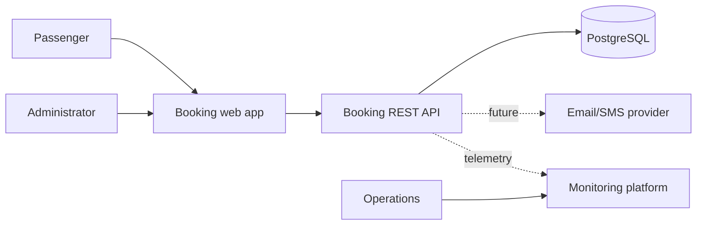
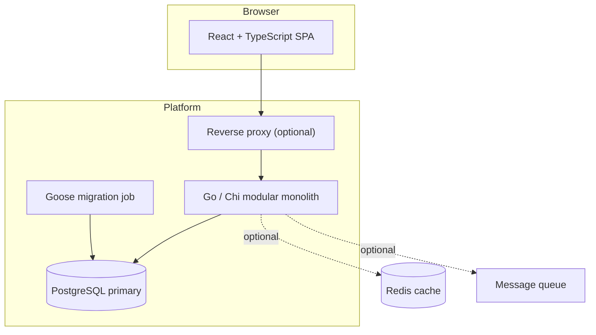
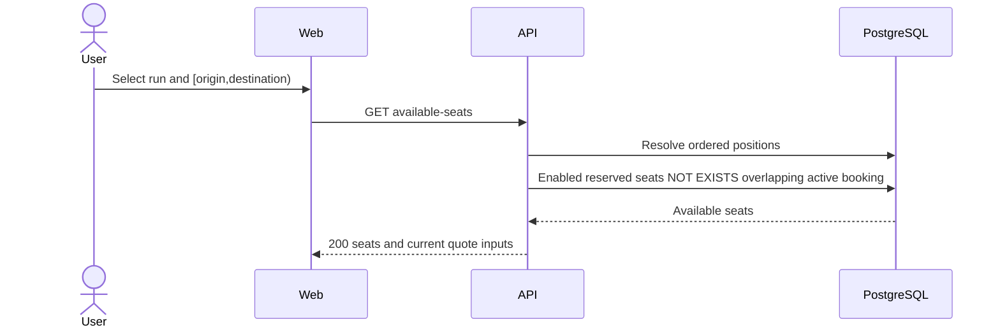
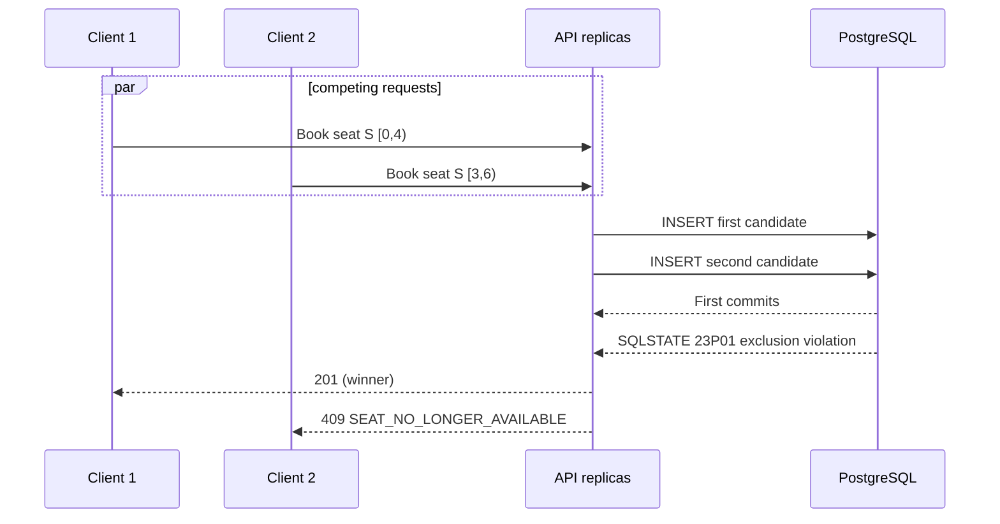

# System Architecture

## Context and containers





Only React → Go REST API → PostgreSQL is required initially. Reverse proxy, Redis, queue, notification provider, object storage and monitoring integrations are optional production additions. Redis must never become the inventory authority.

## Responsibilities and boundaries

The web app owns presentation, transient selections and forms. The API owns authentication hooks, validation, use-case orchestration, fare computation, status policy, idempotency and error mapping. PostgreSQL owns durable configuration, bookings/audits and overlap integrity. Feature services depend on narrow repository interfaces; HTTP and pgx types do not leak into domain policy. One deployable modular monolith keeps transactions local while allowing later extraction based on evidence.

## Request and availability flow

Middleware assigns a request ID, authenticates where required, applies limits/timeouts and logs completion. Handlers decode/validate, services enforce policy, repositories execute generated SQL, and a central mapper returns the OpenAPI error envelope.



Availability is a snapshot and is deliberately not locked. Cache only immutable configuration or short-lived responses; invalidate on booking/cancellation and still rely on insert-time enforcement.

## Booking and concurrency

```mermaid
sequenceDiagram
  actor U as User
  participant W as Web
  participant A as Booking API
  participant F as Fare service
  participant D as PostgreSQL
  U->>W: Confirm booking
  W->>A: POST booking + Idempotency-Key
  A->>A: Validate run, seat, passenger, segment
  A->>F: Calculate/validate fare quote
  F-->>A: Fare snapshot
  A->>D: BEGIN; reserve idempotency key; INSERT booking + audit
  D-->>A: Constraint accepts
  A->>D: COMMIT
  A-->>W: 201 Confirmed booking
```



The database arbitrates across processes. Transactions are short; deterministic write order, bounded statement/lock timeouts, and retry with jitter for deadlock/serialization errors improve recovery. Exclusion conflicts are business outcomes and are not automatically retried.

## Cancellation and lifecycles

```mermaid
sequenceDiagram
  actor U as Passenger
  participant A as API
  participant D as PostgreSQL
  U->>A: POST /bookings/{id}/cancel
  A->>D: BEGIN; lock booking row
  D-->>A: Current status
  A->>D: UPDATE status=CANCELLED; INSERT audit
  A->>D: COMMIT
  A-->>U: 200 booking
```

Train runs move `SCHEDULED → BOARDING → DEPARTED → COMPLETED`, with `SCHEDULED → CANCELLED`; only future `SCHEDULED` runs are bookable. Booking lifecycle is defined in requirements. A worker may later complete bookings and expire holds with idempotent conditional updates.

## Fare lifecycle

Resolve route positions and cumulative distance → select the single effective fare rule for date/class → calculate in integer minor units with specified rounding/minimums → issue a short-lived quote → recompute or validate it during booking → persist rule ID, inputs, breakdown, total and currency. Never trust a client total.

## Failure and recovery

| Failure | Behavior | Recovery |
|---|---|---|
| Database unavailable/pool exhausted | `/ready` fails; API returns 503; no acceptance without commit | Backoff, alert, failover/restore |
| Client disconnect after commit | Outcome may be unknown | Replay same idempotency key or fetch reference |
| Constraint conflict | 409 business response | Refresh seats and choose another |
| Deadlock/serialization failure | Roll back | Server retries safe transaction a small bounded number |
| Migration failure | New release stays unready | Stop rollout; forward-fix or tested rollback |
| Notification failure (future) | Booking remains valid | Transactional outbox and retry/DLQ |
| Corrupt configuration | Reject affected operation | Audit, disable rule/run, restore/versioned correction |

Scale stateless API replicas horizontally; index availability paths; pool connections within DB limits; use read replicas only for non-critical reporting because availability must read the primary. Partition bookings by service date only after measurement because global uniqueness/exclusion and operational complexity increase.
